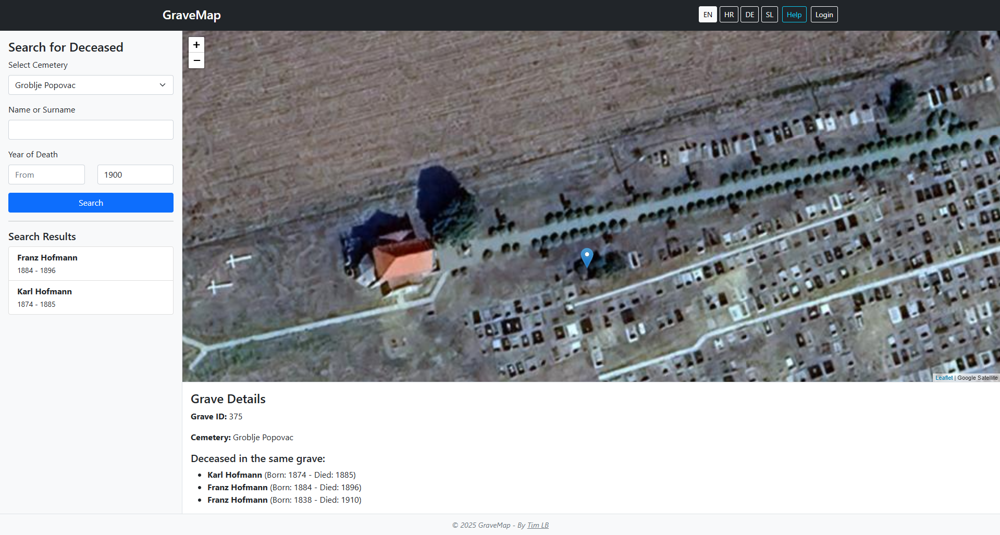
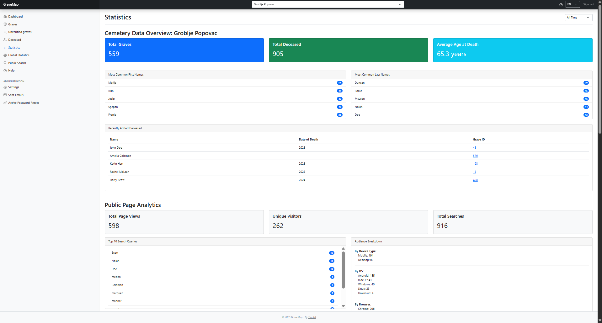

# GraveMap

**GraveMap** is a web application designed for searching and locating graves within cemeteries. It offers a user-friendly, map-based interface that helps visitors easily find specific graves and access detailed information about deceased individuals.

## Features

### Public Features

* **Search for Deceased:** Find graves by name, surname, or year of death.
* **Interactive Map:** Explore the cemetery layout and locate graves visually on an interactive map.
* **Grave Details:** View detailed information about a selected grave.
* **Multilingual Support:** Available in English, Croatian, German, and Slovenian.

### Admin Panel Features

* **Cemetery Management (Super Admin only):** Manage cemeteries with create, edit, and delete options.
* **Grave Management:** Add, edit, or remove graves directly on the interactive map.
* **Deceased Person Management:** Maintain information about deceased individuals and assign them to graves.
* **User Management (Super Admin only):** Manage admin users and their permissions.
* **Dashboard & Statistics:** Access a central hub for quick overviews and analytics of cemetery data.
* **QR Code Generator:** Generate QR codes for graves for easier access.

## Screenshots

| Public - Search Interface                                   | Admin Panel - Grave Management                  | Admin Panel - Statistics                            |
| ----------------------------------------------------------- | ----------------------------------------------- | --------------------------------------------------- |
|  |  |  |

## Live Website

Explore the live website: [GraveMap.eu](https://gravemap.eu)
